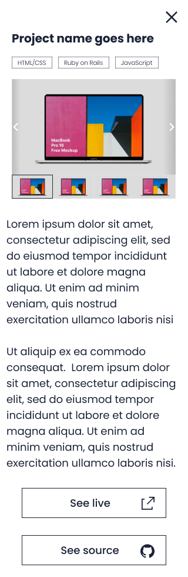
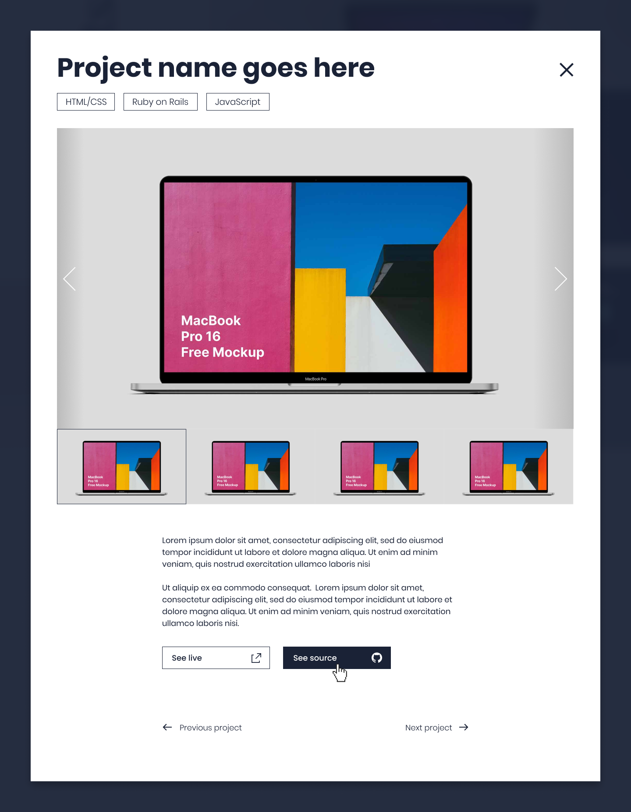

# Portfolio: details popup window

## Learning objectives

- Use basic JavaScript syntax.
- Use JavaScript to manipulate DOM elements.
- Use JavaScript events.
- Understand how to parse a Figma design to create a UI.
- Use objects to store and access data.

### Estimated time: 4.5h

## Description

For this milestone of your portfolio website, you will implement a popup window that includes the project details in both desktop and mobile. In order to do that, you will need to store the information about your projects in a JavaScript object.

*IMPORTANT NOTE: Read **all** requirements before you start building your project.*

### General requirements

- Make sure that there are [no linter errors](https://github.com/microverseinc/linters-config).
- Make sure that you used correct [GitHub flow](https://github.com/microverseinc/curriculum-transversal-skills/blob/main/git-github/articles/github_flow.md).
- Make sure that you documented your work [in a professional way](https://github.com/microverseinc/curriculum-transversal-skills/blob/main/documentation/articles/professional_repo_rules.md).

### HTML/CSS & JavaScript requirements

- Follow our list of [best practices for HTML & CSS](https://github.com/microverseinc/curriculum-html-css/blob/main/articles/html_css_best_practices.md).
- Follow our list of [best practices for JavaScript](https://github.com/microverseinc/curriculum-html-css/blob/main/articles/javascript_best_practices.md).

### Project requirements

_**IMPORTANT NOTE:** For each Microverse project, you need to create a separate pull request. [Read how to work with multiple pull requests in your one repository in the most efficient way](https://github.com/microverseinc/curriculum-transversal-skills/blob/main/git-github/articles/multiple_pull_requests.md)._

- You should implement the following interactions:
  - When the user clicks (or taps) the button to check project details, the popup with details about the project appears.
  - When the user clicks (or taps) the close (X) button, the popup disappears.

- In order to associate each project with the popup window details, you must refactor the project section:
  - You need to use **a JavaScript array to store all of the information for all projects**.
  - For each project you need to store the following pieces of data in a JavaScript object, at a minimum: name, description, featured image, technologies, link to live version, link to source.
  - You need to update the main page so that the projects section is created dynamically using the information stored in that JavaScript object. Remember, all of the HTML in that section is created when the page loads.
  - After that, you could implement the popup window.
- You should implement popups for both mobile and desktop screen sizes:
  - Mobile popup
    

      
    

  - Desktop popup
    

      
    

We included a screenshot of Template 5 for reference, but you should follow the template that you chose.
- You must stick to the design as much as possible (e.g., font, colors, images, text, margins) using [the templates in Figma](https://www.figma.com/file/l7SqJ3ZfkAKih9sFxvWSR4/Microverse-Student-Project-1?node-id=0%3A1).

### Need a big picture?

Remind me about [the big picture of this project](./sneak_peek.md).

## Work and submission mode

- You should implement the above requirements in **all repositories** in your pair-programming group. _That means that each group member needs to open a new pull request in their repo._
- We will check the commit history to make sure that everybody has contributed code on each project.
- You should ask for a review and submit this activity **individually.**

## Code review

Follow [these steps](https://github.com/microverseinc/curriculum-transversal-skills/blob/main/code-review/articles/how_to_ask_for_a_code_review.md) to request a code review of your project.

Each of you needs to request a code review individually.

## Submit your project

After the final approval from a code reviewer, you need to submit your project.
[Read this FAQ for a reminder on how to submit your project.](https://microverse.zendesk.com/hc/en-us/articles/360061344234)
Now go to your Student Dashboard and submit your project.

## Additional requirements

*These are all optional, but if you're interested in exploring this topic further, feel free to implement them. Any exploration here should be done outside program time.*

*If you decide to implement these requirements you should do it in a separate pull request. As always, remember to clearly document your decision in GitHub comments.*

- On desktop, when the user clicks on the "Next project" / "Previous project" buttons, they will navigate to the the next/previous project details in the popup.
- If the project is the first one, the "Previous project" button is disabled
- If the project is the last one, the "Next project" button is disabled
  

    
  

We included a screenshot of Template 5 for reference, but you should follow the template that you chose.

------

_If you spot any bugs or issues in this activity, you can [open an issue with your proposed change](https://github.com/microverseinc/curriculum-transversal-skills/blob/main/git-github/articles/open_issue.md)._
