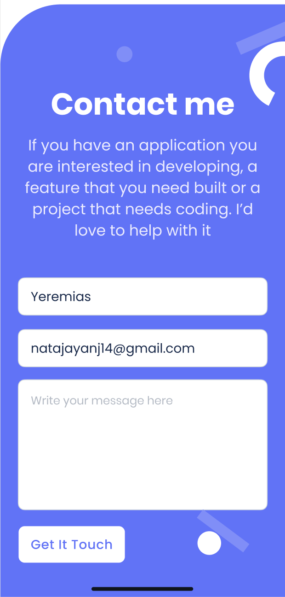

# Portfolio: validate contact form

## Learning objectives

- Process user input according to business rules.
- Use client-side validation to catch and throw errors in the UI.

### Estimated time: 2.5h

## Description

For this milestone of your portfolio website, you will implement a client-side validation of the data in the contact form before submission.

*IMPORTANT NOTE: Read **all** requirements before you start building your project.*

### General requirements

- Make sure that there are [no linter errors](https://github.com/microverseinc/linters-config).
- Make sure that you used correct [GitHub flow](https://github.com/microverseinc/curriculum-transversal-skills/blob/main/git-github/articles/github_flow.md).
- Make sure that you documented your work [in a professional way](https://github.com/microverseinc/curriculum-transversal-skills/blob/main/documentation/articles/professional_repo_rules.md).

### HTML/CSS & JavaScript requirements

- Follow our list of [best practices for HTML & CSS](https://github.com/microverseinc/curriculum-html-css/blob/main/articles/html_css_best_practices.md).
- Follow our list of [best practices for JavaScript](https://github.com/microverseinc/curriculum-html-css/blob/main/articles/javascript_best_practices.md).

### Project requirements

_**IMPORTANT NOTE:** For each Microverse project, you need to create a separate pull request. [Read how to work with multiple pull requests in your one repository in the most efficient way](https://github.com/microverseinc/curriculum-transversal-skills/blob/main/git-github/articles/multiple_pull_requests.md)._

- You need to implement a simple validation:
  - The content of the email field has to be in lower case.
- You should implement the following interactions:
  - When the user submits the form, you check if the email is in lower case.
  - If the validation is OK, the form is sent.
  - If the validation is not OK, you show an error message to the user near the submit button informing them of the error and the form is not sent.
  
  

    
  

We included a screenshot of Template 1 for reference, but you should follow the template that you chose.

- When you create the error message, you should stick to the design guidelines (e.g., font, colors, margins) of [the templates in Figma](https://www.figma.com/file/l7SqJ3ZfkAKih9sFxvWSR4/Microverse-Student-Project-1?node-id=0%3A1).

### Need a big picture?

Remind me about [the big picture of this project](./sneak_peek.md).

## Work and submission mode

- You should implement the above requirements in **all repositories** in your pair-programming group. _That means that each group member needs to open a new pull request in their repo._
- We will check the commit history to make sure that everybody has contributed code on each project.
- You should ask for a review and submit this activity **individually.**

## Code review

Follow [these steps](https://github.com/microverseinc/curriculum-transversal-skills/blob/main/code-review/articles/how_to_ask_for_a_code_review.md) to request a code review of your project.

Each of you needs to request a code review individually.

## Submit your project

After the final approval from a code reviewer, you need to submit your project.
[Read this FAQ for a reminder on how to submit your project.](https://microverse.zendesk.com/hc/en-us/articles/360061344234)
Now go to your Student Dashboard and submit your project.

## Additional requirements

*These are all optional, but if you're interested in exploring this topic further, feel free to implement them. Any exploration here should be done outside program time.*

*If you decide to implement these requirements you should do it in a separate pull request. As always, remember to clearly document your decision in GitHub comments.*

- When the form validation is not OK, you can provide the user with their text converted to lower case so they can use it directly in the input field.

------

_If you spot any bugs or issues in this activity, you can [open an issue with your proposed change](https://github.com/microverseinc/curriculum-transversal-skills/blob/main/git-github/articles/open_issue.md)._
